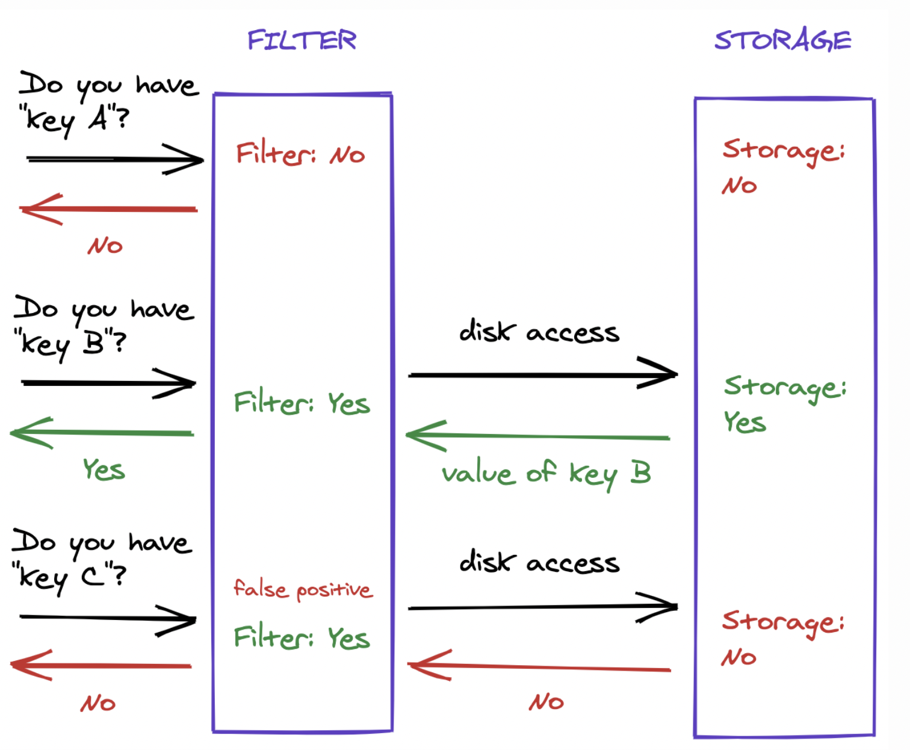
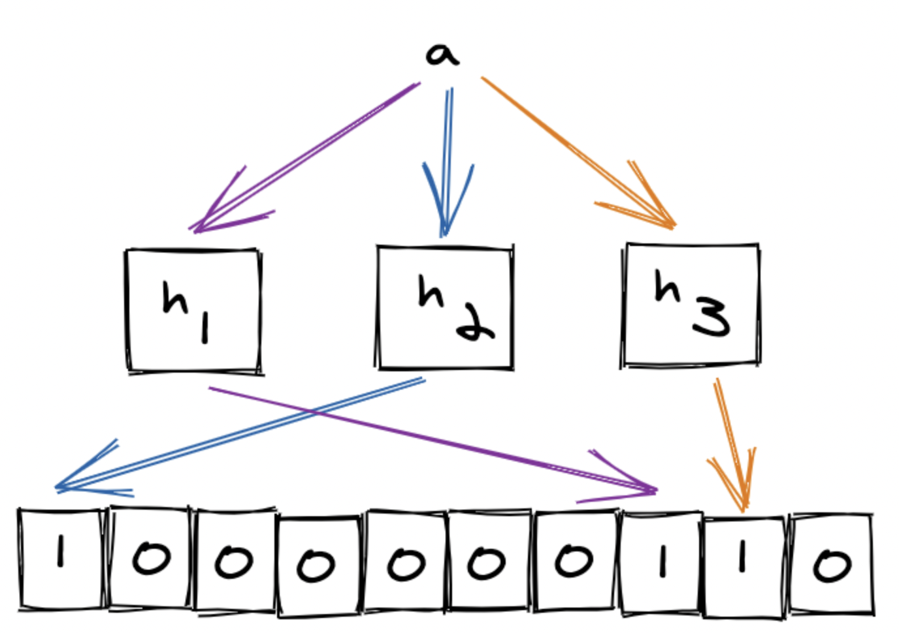
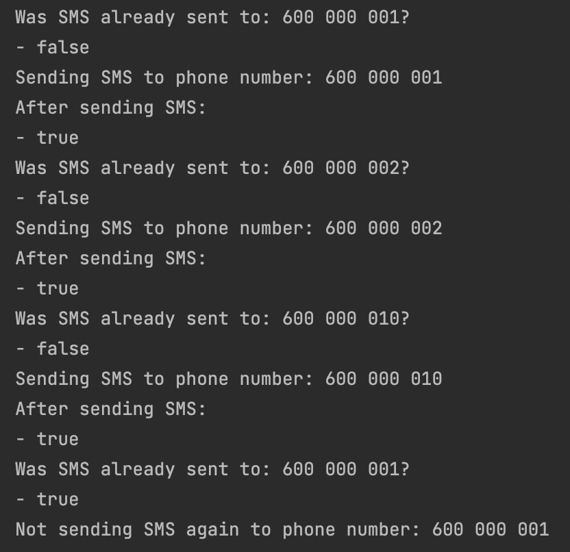
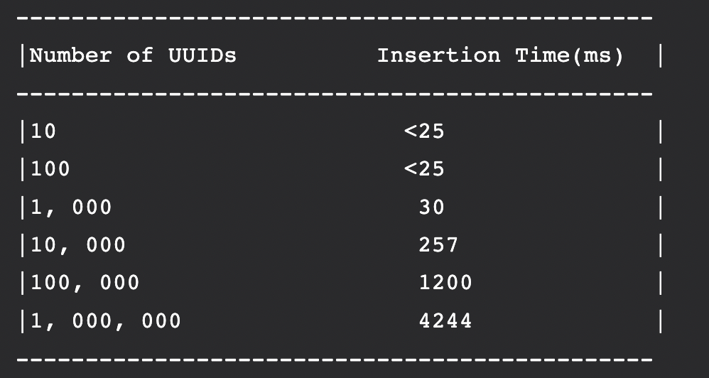
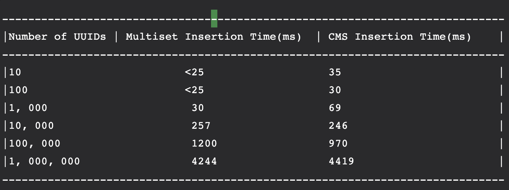

# Bloom Filter - probabilistic data structure

**Bloom filter** is a highly space-efficient probabilistic data structure designed to check the set membership. The
price paid for this efficiency is that a Bloom filter is a probabilistic data structure:

- it tells us that the element either definitely is not in the set or may be in the set.

When we design our Bloom filter, it is important that we provide a reasonably accurate value for the expected number of
elements. Otherwise, our filter will return false positives at a much higher rate than desired. Suppose that we created
a filter with a desired false-positive probability of one percent and an expected 5 elements, but then we inserted
100,000 elements. Because the expected number of elements is so small, the filter will occupy very little memory.
However, as we add more items than expected, the filter becomes over-saturated and has a much higher probability of
returning false positive results than the desired percentage.

The **Guava** project is a collection of several of Google’s core libraries for string processing, caching, etc.

## How does it work?

Allocate an array of bits, each bit in the array is initially set to `0`. The Bloom filter has 2 operations just like a
standard set:

### Insertion

When an element is added to the filter, the bits at the position of the hash code of the element are set to `1`. In
simpler words, the new element is hashed by a number of functions and modded by the set size, resulting in indices into
the bit array. Each bit at the respective index is set.

### Query

To query the membership of an element, we check the bits at indices of his `hashcode % set.size`. If any of them is `0`,
then certainly is not in the set. Otherwise, we assume that is in the set, although it’s possible that some other
element or group of elements hashed to the same indices. This is called a **false positive**. We can target a specific
probability of false positives by selecting an optimal value of and for up to insertions.

A Bloom filter eventually reaches a point where all bits are set, which means every query will indicate membership,
effectively making the probability of false positives. The problem with this is it requires a priori knowledge of the
data set in order to select optimal parameters and avoid “overfilling”.

## Example

Giving a set of phone numbers, we implement a bloom filter to avoid sending sms in case a specific phone already
received a sms before.

## The Bitwise Bloom Filter

A significant disadvantage of the spectral Bloom filter, and other variations on it, is that there is no way of
pre-determining how large a particular item’s count can get. Simply allocating a conservative number of bits to each
counter is a waste of space and using variable size counters adds unnecessary complexity to the implementation and
increases the number of memory accesses required. Motivated by this consideration, the simple idea behind the **Bitwise
Bloom filter** is that each count can be maintained in its binary representation, with each order of magnitude having
its own counting Bloom filter.

### Live Demos of Bloom Filters with one or multiple hash functions:

https://florian.github.io/bloom-filters/

# Count-Min Sketch - probabilistic data structure

Let’s say we want to count the number of times elements appear in a stream of data. A simple solution is to maintain a
hash table that maps elements to their frequencies.

This approach does not scale: Imagine having a stream with billions of elements, most of which are unique. Even if we
are only interested in the most important ones, this method has huge space requirements. Since we do not know for which
items to store counts, our hash table will grow to contain billions of elements.

The Count-Min Sketch, or CMS, is a data structure that solves this problem in an approximate way. Similarly to Bloom
Filters, we save a lot of space by using probabilistic techniques. In fact, a CMS works a bit like a Counting Bloom
Filter, though they do have different use cases.

Problem of using **Multiset** to count the number of times elements appear in it:

Comparison same data set implemented with Count-Min Sketch:

**Count-min sketch** approach is used to count the frequency of the events on the streaming data. Like Bloom filter,
Count-min sketch algorithm also works with hash codes. It uses multiple hash functions to map these frequencies on to
the matrix (Consider sketch here a two-dimensional array or matrix).

### Live Demos of CMS:

https://florian.github.io/count-min-sketch/
